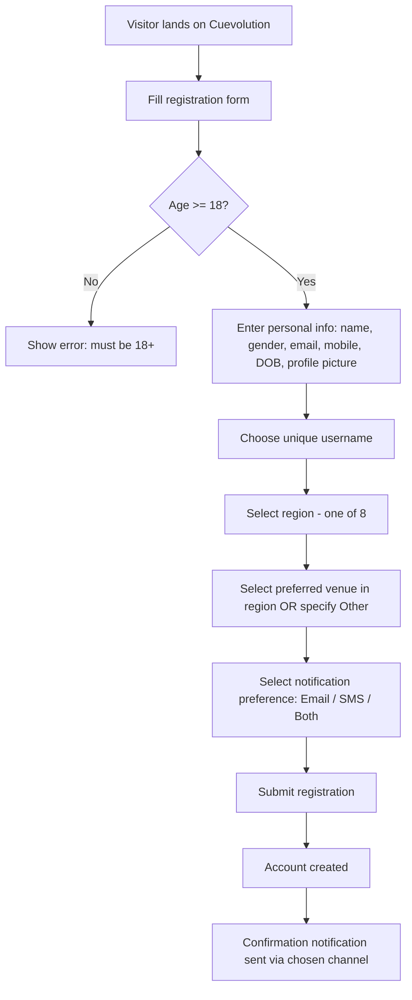
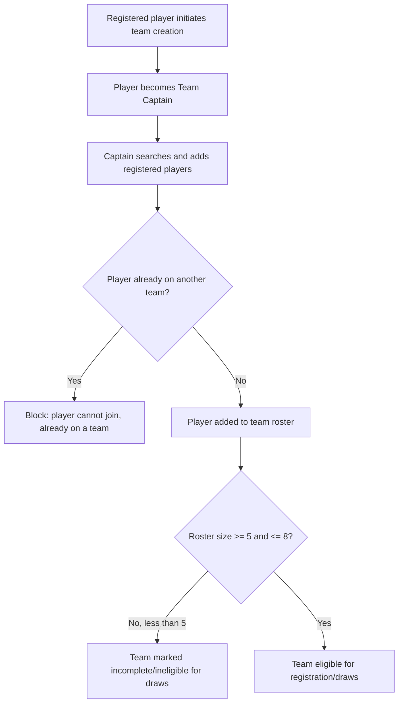
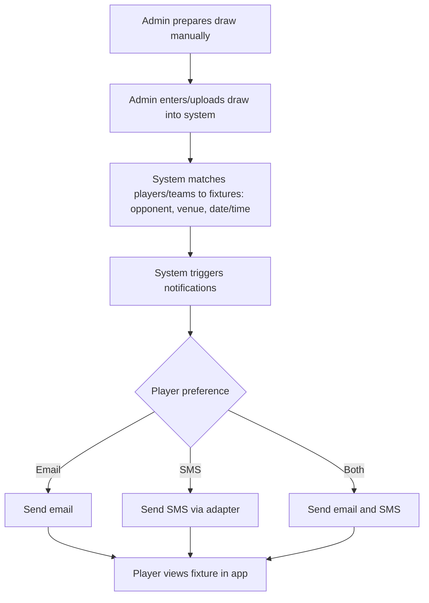
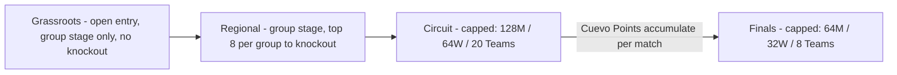

# Cuevolution — Project Scope Document (MVP)

## 1. Overview

Cuevolution is a web application for organizing a nationwide pool (billiards) league in Kenya. It manages player and team registration, regional structuring, a multi-stage qualification pipeline (Grassroots → Regional → Circuit → Finals), manual draw management, results tracking, standings, and notifications.

This document defines the scope for the **MVP**. The platform is expected to grow beyond this scope in future phases (see Section 8).

---

## 2. Regions

The league operates across **8 regions**:

1. Nairobi A
2. Nairobi B
3. Central
4. Eastern
5. Coast
6. Rift A
7. Rift B
8. Nyanza & Western (combined)

A player or team registers under exactly one region.

---

## 3. Categories

- Individual Male Players
- Individual Female Players
- Teams

---

## 4. Qualification Pipeline

```
Grassroots → Regional → Circuit → Finals
```

- **Grassroots**: Open participation (as many players/teams as register in a region). Format is **group/cluster stage only — no knockout**. Progression to Regional is based on group standings/results.
- **Regional**: Open participation, structured as **group stages, with the top 8 from each group progressing to a knockout bracket** to determine advancement to Circuit.
- **Circuit**: Capped entry advancing from Regional stage:
  - 128 Men
  - 64 Women
  - 20 Teams
  - From Circuit onward, players/teams earn **Cuevo Points** (entered manually by admin for MVP) which determine progression to Finals.
- **Finals**: Capped entry advancing from Circuit stage:
  - 64 Men
  - 32 Women
  - 8 Teams

> **Note:** Capacity numbers (128/64/20 at Circuit, 64/32/8 at Finals) should be configurable values, not hardcoded, to allow adjustment across seasons.

---

## 5. MVP Scope

### 5.1 Player Registration
- Free registration for players aged **18+**.
- Player provides: full name, age, profile picture, username (unique), gender, email, mobile number, location/town, and region (one of the 8).
- Player selects a preferred venue from a region-specific preloaded list, or selects "Other" and specifies manually.
- Player sets notification preference: Email, SMS, or both.
- Player can change their region **only before their first recorded match**; locked thereafter.
- Player can belong to **only one team**.

### 5.2 Team Registration
- A registered player becomes a **Team Captain** and creates a team.
- Captain directly adds other **already-registered players** to the team (no invite/accept flow for MVP).
- Team size: **minimum 5, maximum 8** players.
- A team must have a minimum of 5 players to be considered valid/eligible for draws.
- Teams are tied to a single region.

### 5.3 Venues
- Venues are preloaded per region by the admin.
- Venue selection is a general player preference, not tied to a specific stage or match.

### 5.4 Draws
- Draws are done **manually by the admin** (outside or within the system) and then **uploaded/entered into the system**.
- Upon draw entry, affected players/teams receive notifications of when, where, and who they play against.

### 5.5 Match Results
- Admin enters match results into the system (players do not self-report results).
- At Grassroots, results determine group standings, which in turn determine progression to Regional (no knockout at this stage).
- At Regional, group-stage results determine the top 8 per group; results of the subsequent knockout bracket determine progression to Circuit.
- From Circuit stage onward, admin manually enters **Cuevo Points** per player/team per match.

### 5.6 Standings
- Public standings/rankings for Individual Male, Individual Female, and Team categories, visible to all players.

### 5.7 Notifications
- Channels: Email and/or SMS (player may select both).
- SMS is implemented behind an **adapter/interface** so the provider can be swapped later (provider TBD).
- Notification events for MVP:
  - Registration confirmation
  - Draw/match assignment (when, where, opponent)
- One global notification preference applies across all notification types (not per-event).

### 5.8 Admin
- Single admin role for MVP (no regional admin tier).
- Admin capabilities: manage venues, manage/approve regions, enter and upload draws, enter match results and points, oversee player/team data.

---

## 6. Out of Scope for MVP

- Payments or registration fees
- Player self-submission of match scores
- Any public site/leaderboard beyond in-app standings
- Native mobile app (web only, though built with LiveView for responsiveness)
- Automatic point-calculation formulas (points are manually entered by admin)
- Multiple/regional admin roles
- Team invite-and-accept workflow (captain adds players directly)
- Player relocation/region change after first match

---

## 7. User Flows

### 7.1 Player Registration Flow



### 7.2 Team Creation Flow



### 7.3 Draw & Notification Flow



### 7.4 Qualification Pipeline Flow



---

## 8. Future Considerations (Post-MVP)

- Automatic points/ranking calculation engine
- Player self-service score submission with admin verification
- Regional admin roles
- Team invite/accept workflow
- Payments (registration fees, sponsorships)
- Mobile app
- Public-facing site beyond standings
- Configurable/multiple SMS providers via the adapter already in place
- Player region-change workflows beyond the "before first match" rule

---

## 9. Open Items / Assumptions to Revisit

- SMS provider selection (adapter pattern in place; provider TBD).
- Cuevo Points formula (manual entry for MVP; formula design deferred).
- Profile picture constraints (file size/type) — deferred to implementation.
- Handling of a team that drops below 5 players after initial validation (e.g., due to player withdrawal) — not yet defined for MVP; recommend flagging as ineligible until restored to 5+.
